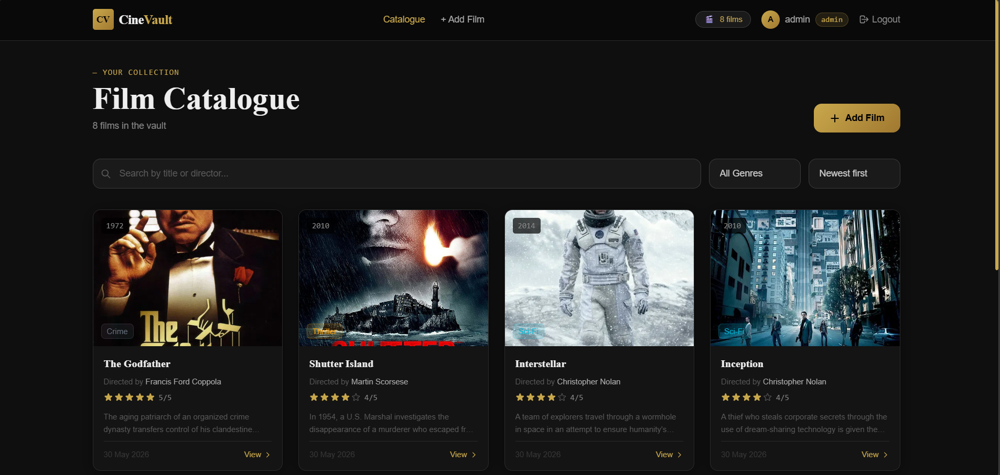
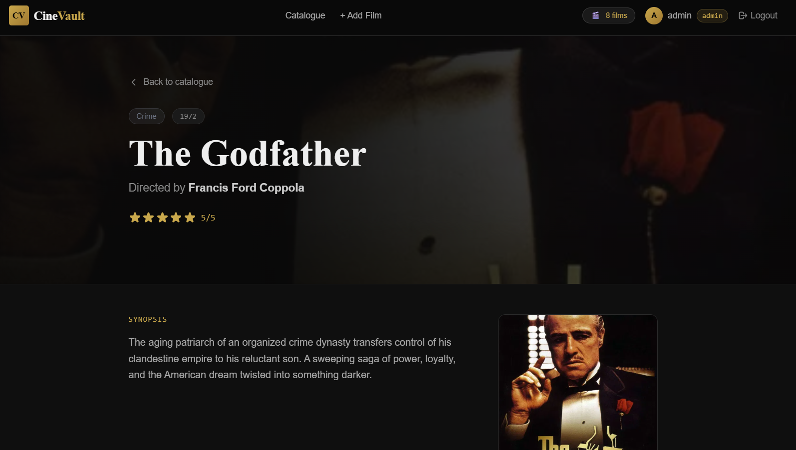
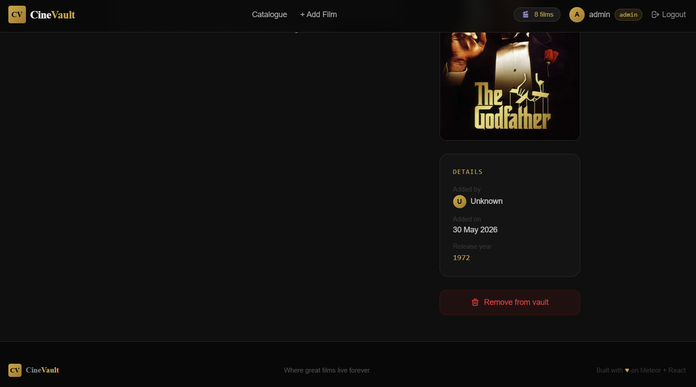
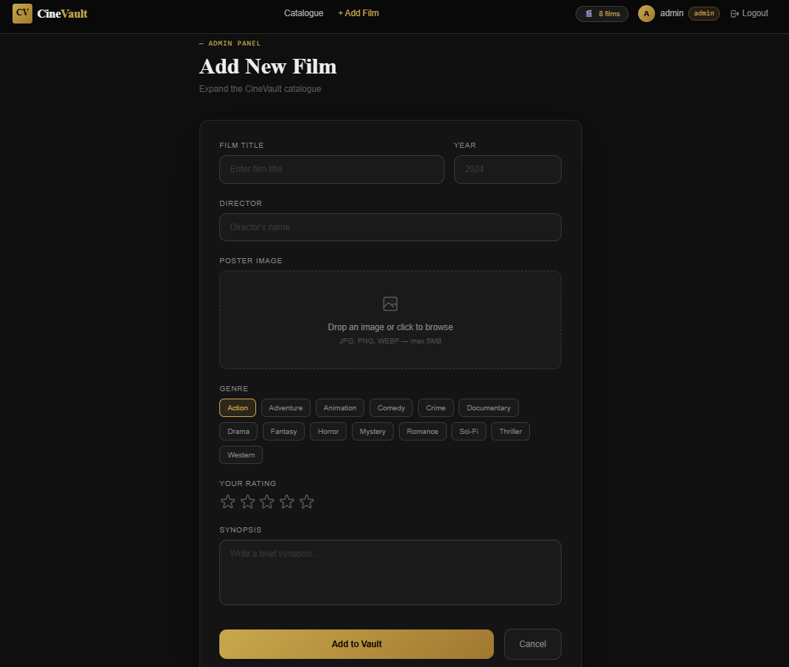
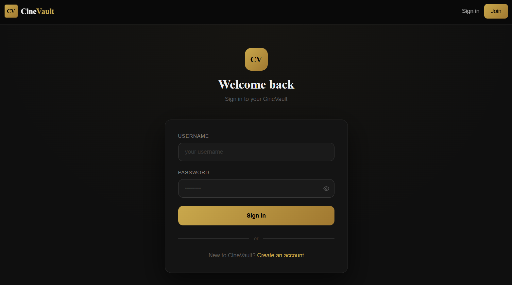
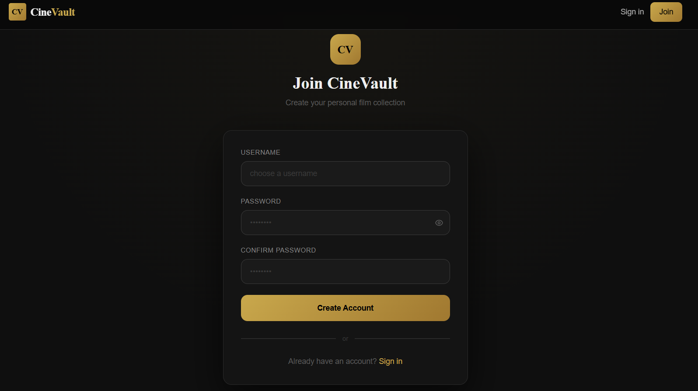

<div align="center">

<br />

# CineVault

**A personal film catalogue — curated, rated, and stored the way you like it.**

<br />

[](https://www.meteor.com/)
[](https://react.dev/)
[](https://www.typescriptlang.org/)
[](https://tailwindcss.com/)
[](https://www.mongodb.com/atlas)
[](https://reactrouter.com/)

<br />

</div>

---

## Table of Contents

- [Overview](#overview)
- [Screenshots](#screenshots)
- [Features](#features)
- [Tech Stack](#tech-stack)
- [Project Structure](#project-structure)
- [Prerequisites](#prerequisites)
- [Installation](#installation)
- [Configuration](#configuration)
- [Running the App](#running-the-app)
- [Admin Account](#admin-account)
- [Deployment](#deployment)
- [Roadmap](#roadmap)

---

## Overview

CineVault is a full-stack web application for building and managing a personal film collection. An admin account controls the catalogue — adding films complete with poster images, star ratings, genres, and synopses. Registered users can browse, search, filter, and read the full detail page for every film.

Poster images are stored as **base64 directly in MongoDB** — no S3, no file server, no extra infrastructure.

The interface is built around a dark cinema aesthetic: deep blacks, gold accents, Playfair Display headings, and animated card transitions.

---

## Screenshots

### Film Catalogue



<br />

### Film Detail Page




<br />

### Add Film — Admin Panel



<br />

### Login & Sign Up




---

## Features

### All users

- Register and sign in with a username and password
- Browse the full film catalogue in a responsive card grid
- Real-time search by title or director
- Filter by genre — 14 genres available
- Sort by newest first, highest rated, or A → Z
- View a full detail page per film with poster, synopsis, star rating, and metadata

### Admin only

- Add films with title, director, year, genre, rating (1–5 stars), synopsis, and a poster image
- Poster upload via **drag-and-drop** or click-to-browse (JPG · PNG · WEBP — max 5 MB)
- Poster stored as base64 in MongoDB — no external storage needed
- Delete any film from the card grid or from its detail page

### Under the hood

- **Fully async** — Meteor 3 API throughout: `callAsync`, `findOneAsync`, `insertAsync`, `removeAsync`, `loginWithPasswordAsync`, `logoutAsync`
- **Role-based access** — admin identity checked server-side on every write operation
- **Reactive UI** — Meteor publications + `useTracker` keep the UI in sync with the database in real time
- **Type-safe** — TypeScript end-to-end, including the `Movie` interface and `Genre` union type
- **Session persistence** — users stay logged in across page refreshes

---

## Tech Stack

### Runtime dependencies

| Package             | Version     | Purpose                                                  |
| ------------------- | ----------- | -------------------------------------------------------- |
| `meteor`            | **3.4.1**   | Full-stack framework — DDP, pub/sub, methods, build tool |
| `react`             | **19.1.0**  | UI library                                               |
| `react-dom`         | **19.1.0**  | React DOM renderer                                       |
| `react-router-dom`  | **6.30.1**  | Client-side routing                                      |
| `tailwindcss`       | **3.4.17**  | Utility-first CSS framework                              |
| `autoprefixer`      | **10.4.21** | PostCSS vendor prefix plugin (required by Tailwind)      |
| `postcss`           | **8.5.3**   | CSS transform pipeline                                   |
| `bcrypt`            | **5.1.1**   | Password hashing (used by Meteor Accounts)               |
| `meteor-node-stubs` | **1.2.12**  | Node.js polyfills for the browser bundle                 |
| `@babel/runtime`    | **7.26.0**  | Babel async/await runtime helpers                        |

### Dev dependencies

| Package            | Version    | Purpose                     |
| ------------------ | ---------- | --------------------------- |
| `typescript`       | **5.8.3**  | Static typing               |
| `@types/react`     | **19.1.0** | React type definitions      |
| `@types/react-dom` | **19.1.0** | ReactDOM type definitions   |
| `@types/meteor`    | **2.9.11** | Meteor type definitions     |
| `chai`             | **4.5.0**  | Assertion library for tests |

### Key Meteor packages (`.meteor/packages`)

| Package                    | Purpose                                           |
| -------------------------- | ------------------------------------------------- |
| `meteor-base`              | Core Meteor runtime                               |
| `accounts-password`        | Username/password authentication                  |
| `react-meteor-data`        | `useTracker` hook — reactive Meteor data in React |
| `mongo`                    | MongoDB collection driver                         |
| `check`                    | Runtime argument validation in methods            |
| `typescript`               | TypeScript compilation                            |
| `tailwindcss` (atmosphere) | Tailwind integration with Meteor build            |

---

## Project Structure

```
cinevault/
│
├── client/
│   ├── main.html           # HTML shell — single div mount point
│   ├── main.tsx            # Entry point — createRoot + Meteor.startup
│   ├── main.css            # Global styles, Tailwind directives, custom animations
│   └── keep-logged-in.ts   # Persists login session across browser refreshes
│
├── server/
│   └── main.ts             # Imports all server-side API modules
│
├── imports/
│   │
│   ├── api/
│   │   ├── moviesMethods.ts       # movies.insert · movies.remove (async, admin-gated)
│   │   ├── moviesPublications.ts  # Meteor.publish('movies')
│   │   ├── usersMethods.ts        # users.insert — create account (async)
│   │   └── usersPublications.ts   # Meteor.publish('users') — username only
│   │
│   ├── db/
│   │   └── MoviesCollection.ts    # Mongo.Collection + Movie interface + GENRES constant
│   │
│   └── ui/
│       ├── App.tsx            # BrowserRouter + route tree + auth guards
│       ├── Layout.tsx         # Sticky nav, responsive mobile menu, footer
│       ├── MovieList.tsx      # Catalogue grid — search, filter, sort
│       ├── MovieCard.tsx      # Film card with poster image or genre gradient fallback
│       ├── MovieDetails.tsx   # Full detail page — poster hero, synopsis, sidebar
│       ├── AddMovie.tsx       # Admin form — PosterUpload (drag-drop), StarPicker
│       ├── Login.tsx          # Sign in with loginWithPasswordAsync
│       ├── Signup.tsx         # Register with password strength indicator
│       ├── Toast.tsx          # Global toast notification context + hook
│       └── NotFound.tsx       # 404 page
│
├── tests/
│   └── main.js               # Test entry point (Mocha)
│
├── package.json
├── tailwind.config.js         # Custom cinema colour palette + fonts + animations
├── tsconfig.json
├── postcss.config.js
└── settings.json              # ⚠️ Local only — MongoDB URL (never commit this)
```

---

## Prerequisites

Before you start, make sure you have the following installed:

### 1. Node.js

Meteor 3.4 requires **Node.js 20**.

```bash
node --version
# v20.x.x
```

Download from [nodejs.org](https://nodejs.org/) or use a version manager:

```bash
# using nvm
nvm install 20.20.2
nvm use 20.20.2
```

### 2. Meteor 3.4.1

```bash
# macOS / Linux
curl https://install.meteor.com/ | sh

# Windows — use the official installer:
# https://www.meteor.com/install
```

Pin the exact version after installing:

```bash
meteor update --release 3.4.1
```

Verify:

```bash
meteor --version
# Meteor 3.4.1
```

### 3. MongoDB Atlas account

CineVault connects to MongoDB Atlas (free tier works fine).

1. Create a free account at [cloud.mongodb.com](https://cloud.mongodb.com)
2. Create a **free M0 cluster**
3. Create a **database user** with read/write access
4. Under **Network Access**, add `0.0.0.0/0` to allow connections from anywhere (or your specific IP)
5. Click **Connect** → **Drivers** → copy your connection string — you will need it in the next step

---

## Installation

**1 — Clone the repo**

```bash
git clone git@github.com:yacineak97/cinevault.git
cd cinevault
```

**2 — Install npm dependencies**

```bash
meteor npm install
```

> Always use `meteor npm` (not plain `npm`) so packages are installed against the Node version bundled with Meteor.

---

## Configuration

Create a `settings.json` file at the root of the project:

```json
{
	"galaxy.meteor.com": {
		"env": {
			"MONGO_URL": "mongodb+srv://:@cluster0.xxxxx.mongodb.net/cinevault?retryWrites=true&w=majority",
			"MONGO_OPLOG_URL": "mongodb+srv://:@cluster0.xxxxx.mongodb.net/local",
			"ROOT_URL": "https://your-app-name.meteorapp.com"
		}
	}
}
```

Replace `<username>`, `<password>`, and the cluster hostname with your Atlas values.

> **⚠️ Connection problem with `mongodb+srv://`?**
>
> Some networks (university WiFi, certain ISPs) block SRV DNS lookups or port 27017,
> which causes a `querySrv ECONNREFUSED` error. In that case, use the **standard connection
> string** instead — go to **Atlas → Connect → Connect your application → Node.js → version 3.6**
> and copy the URL that starts with `mongodb://` (not `mongodb+srv://`). It includes all 3
> shard hosts explicitly and bypasses the SRV lookup entirely:
>
> ```json
> "MONGO_URL": "mongodb://<username>:<password>@cluster0-shard-00-00.xxxxx.mongodb.net:27017,cluster0-shard-00-01.xxxxx.mongodb.net:27017,cluster0-shard-00-02.xxxxx.mongodb.net:27017/cinevault?ssl=true&replicaSet=atlas-xxxxx-shard-0&authSource=admin&retryWrites=true&w=majority"
> ```
>
> Same change applies to `MONGO_OPLOG_URL` — same URL but replace the database name with `local`
> and use your oplog user credentials.

> ⚠️ **Add `settings.json` to `.gitignore` immediately.** It contains your database credentials and must never be committed.
>
> ```bash
> echo "settings.json" >> .gitignore
> ```

---

## Running the App

```bash
meteor run --settings settings.json
```

Open [http://localhost:3000](http://localhost:3000) — the app will hot-reload on any file change.

**Other useful commands:**

```bash
# Run with verbose logs
meteor run --settings settings.json --verbose

# Run tests once
meteor test --once --driver-package meteortesting:mocha --settings settings.json

# Analyse bundle size
meteor --production --extra-packages bundle-visualizer --settings settings.json
```

---

## Admin Account

The app has a single privileged role identified by the username **`admin`**. This is enforced server-side — the username is checked inside every method before any write is allowed.

**To set up the admin:**

1. Start the app
2. Navigate to [http://localhost:3000/signup](http://localhost:3000/signup)
3. Register with the username exactly: **`admin`**
4. Use a strong password

Once logged in as `admin` you will see the **+ Add Film** link in the nav bar and the **Add Film** button on the catalogue page. All other accounts are read-only.

> If you want to change the admin username, update the `user.username !== 'admin'` check in `imports/api/moviesMethods.ts` and `imports/api/usersMethods.ts`.

---

## Deployment

CineVault is ready to deploy to [Meteor Galaxy](https://www.meteor.com/cloud) — the official Meteor hosting platform.

**1 — Build and deploy**

```bash
DEPLOY_HOSTNAME=galaxy.meteor.com meteor deploy your-app.meteorapp.com --settings settings.json
```

Replace `your-app` with your chosen subdomain.

**2 — Set environment variables on Galaxy**

In the Galaxy dashboard → your app → **Environment**:

| Variable    | Value                                     |
| ----------- | ----------------------------------------- |
| `MONGO_URL` | Your full MongoDB Atlas connection string |
| `ROOT_URL`  | `https://your-app.meteorapp.com`          |

**3 — Verify**

Visit `https://your-app.meteorapp.com` — the app should be live and connected to Atlas.

---

## Roadmap

- [ ] Edit film details (admin)
- [ ] User watchlist / personal favourites
- [ ] TMDB API integration — auto-fill metadata from a film title
- [ ] Pagination or infinite scroll for large catalogues
- [ ] Public / private catalogue mode

---

## Author

Yacine Akli
